# ST-LINK-V2
依据参考资料制作ST-LINK-V2，并实践一些Allegro技巧。

## 初衷

* 自己做一些ST-LINK便于后期自己调试STM32芯片
* 扩展一些UART，I2C，GPIO接口出来，其他时候作为一个STM32F103开发板用
* 重新熟悉下Allegro软件，并实践一些新版本的技巧
* 自己根据需要，亲自做里面用到的所有器件的封装和3D

## 产品效果图

### Nucleo版本

* 正面

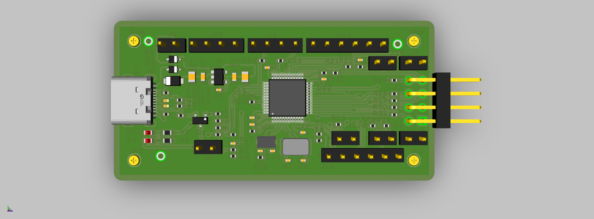

* 背面

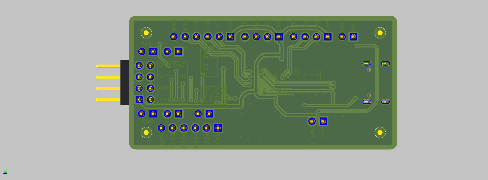

* 为了方便以后可能用加热台自己贴片，所以尽量将元器件布置在同一面
* 为了最大化降低成本，采用双层板设计，但依旧尽力保证设计规范和美观

## 回板焊接

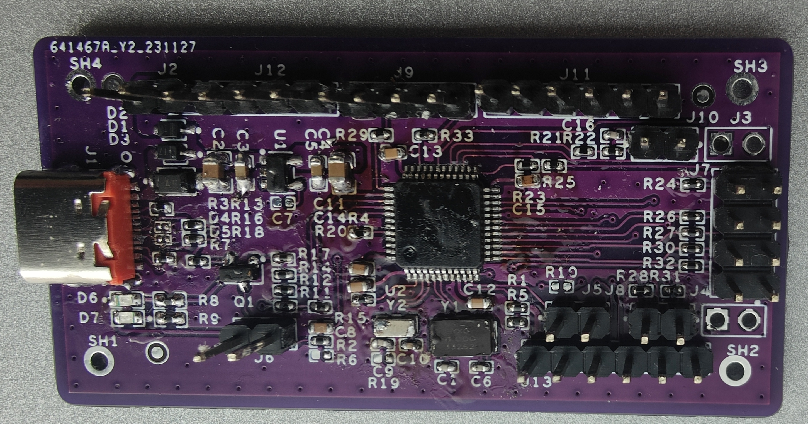

### 优化版

* 在Nucleo版本上进行了一些优化，去除了不必要的东西，然后按照自己的想法进行了一些接口的预留

* 正面

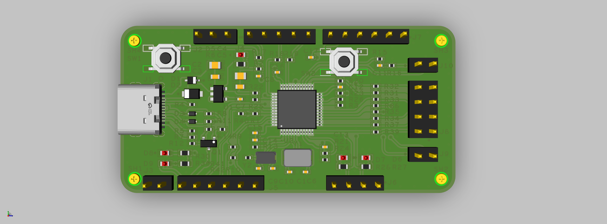

* 背面

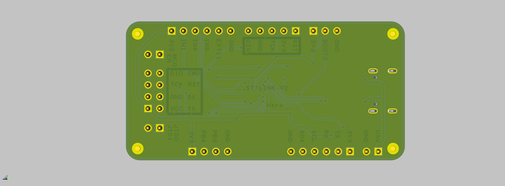

* 拼板效果图

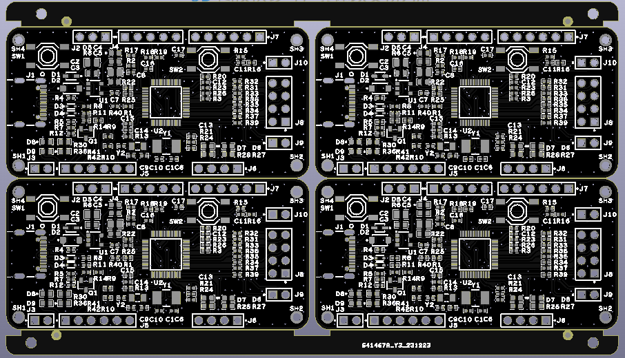

* PCB回板

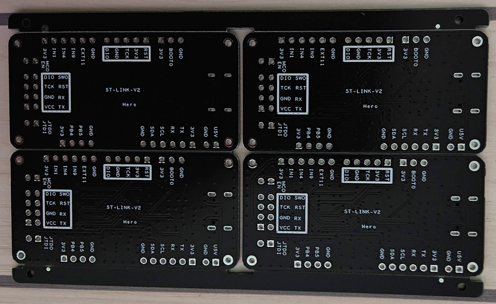

* 成品

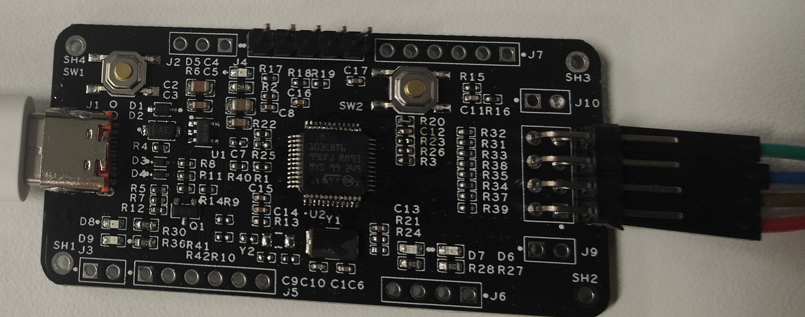

## 原理介绍

借鉴于：https://oshwhub.com/CYIIOT/ST_LINK-V2_1

### 简介

* ST-Link的硬件，官方推出了三大版本：V1、V2和V3。在官方《TN1235 ST-LINK衍生产品概述》中有详细的说明。
* ST-Link/V2：支持STM32和STM8调试，不带虚拟串口，TB上卖的大多是这种，目前手头还有好几个这个版本的ST-Link。后面会使用这个版本进行烧录。
* ST-Link/V2-1：支持STM32调试，带虚拟串口和虚拟U盘下载，目前ST官方的Nucleo系列评估板上面板载的ST-Link就是这个版本。
* 潘多拉开发板上的ST-link V2-1 出厂主控使用的是FLASH 容量为64K的STM32F103C8T6，但是ST-link V2-1最新的固件已经超过了64K，芯片容量不足。 因此本项目主控选择的是FLASH容量为128KB的STM32F103CBT6（商品编号：C8304），这是C8T6的大容量版本，可以直接PIN to PIN 替换。也可以使用合宙通信推出的AIR32F103CBT6，有伙伴测试是OK的。
  * AIR32F103CBT6参考链接：[AIR32F103芯片 - LuatOS 文档](https://wiki.luatos.com/chips/air32f103/mcu.html)

### 版本检测和处理

* All ST-Link variants:
    * PC13/14 open -> Standalone ST-Link v2 or baite, some STM32 Disco w/o accessible UART RX/TX
    * PC13 low -> SWIM internal connection
    * PC13/PC14 both low -> ST-Link v2 on some F4_Diso boards.

### USB 枚举

* USB设备的电流是设备接入计算机的时候，枚举的过程中向计算机申请的，有一个8位寄存器，值范围是0~24，对应的电流是20mA~500mA。如果枚举过程中设备没有向计算机提交这个需要电流的值，计算机则默认按最大电流提供，USB2.0设备是500mA，USB1.1设备是200mA。

* 标准下行端口（SDP）
    * 这种端口的D+和D-线上具有15kΩ下拉电阻。限流值为：挂起时2.5mA，连接时为100mA，连接并配置为较高功率时为500mA。

* 根据USB协议，工作在主机模式，USB DP/DM下拉到GND，工作在设备模式，上拉到VCC（DP上拉表示高全速设备，DM上拉表示低速设备，STM32在Device模式只支持高速或全速）。
    * STM32F103的USB是全速的从设备，所以D+上需要一个1.5K的上拉电阻。建议用一个IO口控制这个上拉电阻，因为插入USB主机时，如果直接接这个上拉电阻，USB主机会直接枚举设备，如果STM32F103没有准备好则可能识别错误。如果用GPIO控制，可以保证STM32F103已经准备好了再枚举设备。

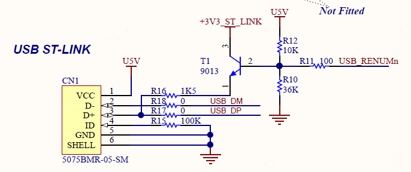

### 32.768KHz晶振

* 我的板子上预留了一个小封装的32.768KHz晶振，方便后期改为通用开发板功能。

### 电源

* 当ST-LINK的USB供电时：
    * ST-LINK使用一个3.3V 150mA LDO进行供电，供电电源为+3V3_ST_LINK。
    * 在USB枚举之前，只有ST-LINK部分供电，因为主机PC只能提供100mA电流。在USB枚举过程中，Nculeo板向主机PC请求300mA电流，如果主机可提供所需电流，则通过PWR_ENn拉低打开U5V供电MOS，这时目标MCU的3.3V LDO会输出3.3V电压，目标板开始供电。如果请求失败，则不打开U5V供电MOS。
    * PWR_EXT(PB3)作用：
        * 如果接ST_LINK的3.3V供电电源，则允许最大电流100mA，使用U5V供电的话，要连接,可以选择4.7K上拉；
        * 如果浮空，则允许最大电流300mA；

* E5V是外部7-12V的供电，通过一个5.0V 800mA的 LDO进行供电。

* AIN_1功能:
    * ST-LINK在烧录时，通过PWR_ENn拉低打开U5V供电MOS，这时目标MCU的3.3V LDO会输出3.3V电压。
    * AIN_1引脚通过上下各4.7K的分压电阻，判断MCU供电是否正常，如果只是做ST_LINK功能，直接接ST_LINK的3.3V供电电源。

### BOOT启动配置

* 一般来说就是指我们下好程序后，重启芯片时，SYSCLK的第4个上升沿，BOOT引脚的值将被锁存。用户可以通过设置BOOT1和BOOT0引脚的状态，来选择在复位后的启动模式。
    * 1、第一种方式(boot0 = 0)：Flash memory启动方式，启动地址：0x08000000 是STM32内置的Flash，一般我们使用JTAG或者SWD模式下载程序时，就是下载到这个里面，重启后也直接从这启动程序。基本上都是采用这种模式。
    * 2、第二种方式(boot0 = 1；boot1 = 0)：System memory启动方式，启动地址：0x1FFF0000从系统存储器启动，这种模式启动的程序功能是由厂家设置的。一般来说，这种启动方式用的比较少。系统存储器是芯片内部一块特定的区域，STM32在出厂时，由ST在这个区域内部预置了一段BootLoader， 也就是我们常说的ISP程序， 这是一块ROM，出厂后无法修改。一般来说，我们选用这种启动模式时，是为了从串口下载程序，因为在厂家提供的BootLoader 中，提供了串口下载程序的固件，可以通过这个BootLoader将程序下载到系统的Flash中。但是这个下载方式需要以下步骤：
        * 1、将BOOT0设置为1，BOOT1设置为0，然后按下复位键，这样才能从系统存储器启动BootLoader
        * 2、最后在BootLoader的帮助下，通过串口下载程序到Flash中
        * 3、程序下载完成后，又有需要将BOOT0设置为GND，手动复位，这样，STM32才可以从Flash中启动可以看到， 利用串口下载程序还是比较的麻烦，需要跳帽跳来跳去的，非常的不注重用户体验。
    * 3、第三种方式(boot0 = 1;boot1 = 1)：SRAM启动方式。，启动地址：0x20000000 内置SRAM，既然是SRAM，自然也就没有程序存储的能力了，这个模式一般用于程序调试。假如我只修改了代码中一个小小的 地方，然后就需要重新擦除整个Flash，比较的费时，可以考虑从这个模式启动代码（也就是STM32的内存中），用于快速的程序调试，等程序调试完成后，在将程序下载到SRAM中。
* 关于启动地址，理论上，CM3中规定上电后CPU是从0地址开始执行，但是这里中断向量表却被烧写在0x0800 0000地址里(Flash memory启动方式)，那启动时不就找不到中断向量表了？既然CM3定下的规矩是从0地址启动，SMT32当然不能破坏ARM定下的“规矩”，所以它做了一个启动映射的过程，就是和芯片上总能见到的BOOT0和BOOT1有关了，当选择从主Flash启动模式后，芯片一上电，Flash的0x0800 0000地址被映射到0地址处，不影响CM3内核的读取，所以这时的CM3既可以在0地址处访问中断向量表，也可以在0x0800 0000地址处访问中断向量表，而代码还是在0x0800 0000地址处存储的。
* 关于flash死锁的解决办法(Flash memory启动方式)，开发调试过程中，由于某种原因导致内部Flash锁死，无法连接SWD以及JTAG调试，无法读到设备，可以通过修改BOOT模式重新刷写代码。修改为BOOT0=1，BOOT1=0即可从系统存储器启动，ST出厂时自带Bootloader程序，SWD以及JTAG调试接口都是专用的。重新烧写程序后，可将BOOT模式重新更换到BOOT0=0，BOOT1=X即可正常使用。

* 我们可以通过10K或100K电阻接VCC或者GND，建议BOOT1接地，BOOT0预留一个3 Pin端子，以防后期芯片flash锁死了。

### PB10作用

* 暂时没搞懂，我看别人不接和接VCC，VDD都没有影响。

### COM指示灯

* 在ST官方的ST-Link V2.1图纸中有一个名为COM的指示灯,这是一个红绿双色的LED指示灯，就是下图所示的这个LED。

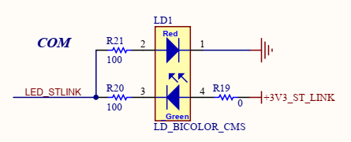

* 那么这个指示灯有什么作用呢，在官方的TN1235技术手册中有专门的介绍，截取相关部分如下：

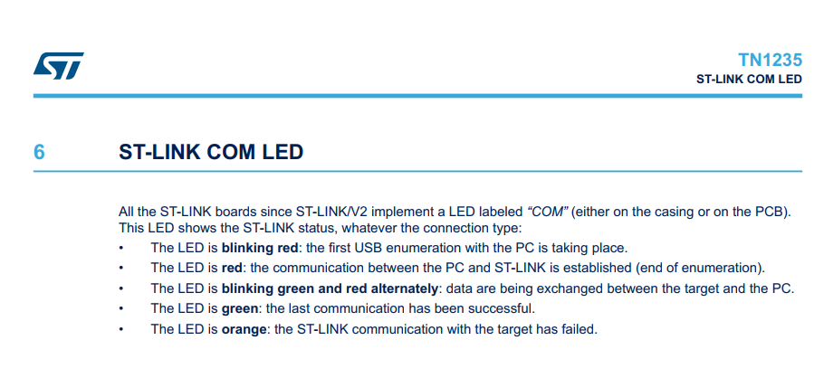

* 自ST-LINK/V2起，所有ST-LINK板均带有一个标有“COM”的LED（在外壳或PCB上）。无论连接类型如何，此LED都会显示ST-LINK状态：
    * LED呈红色闪烁：正在与PC进行第一个USB枚举。
    * LED为红色：PC与ST-LINK之间的通信已建立（枚举结束）。
    * LED呈绿色和红色交替闪烁：正在目标和PC之间交换数据。
    * LED为绿色：上一次通信已成功。
    * LED为橙色：与目标的ST-LINK通信失败

## 烧录固件

### 固件版本

* 由于官方没有将ST-Link里面源码公开，同时也没有直接给出ST-Link固件（读保护），但是目前（2020年7月）网上已有流传多个版本的固件。
    * 版本一：STLink V2.J16.S4版本固件：标准V2版本，支持SWD和SWIM接口，这个版本的固件是。
    * 版本二：STLink V2.J28.M18版本固件：是用于ST-LINK/V2-1、ST-LINK/V2-A、ST-LINK/V2-B板(具有STM32调试接口、大容量存储接口、虚拟COM端口)的版本。
    * 本项目制作ST-Link V2-1 必须使用V2.J28.M18这个版本作为烧录的固件版本。

### 烧录工具

* 第一次烧录固件可使用这两个工具：
    * STM32CubeProg
    * STM32 ST-LINK Utility
* 本次烧录使用STM32 ST-LINK Utility，STM32 ST-LINK Utility的功能比STM32CubeProg要稍微简单一些，其主要功能也是编程（下载）。烧录截图如下，操作很简单，大概看一下就知道了:

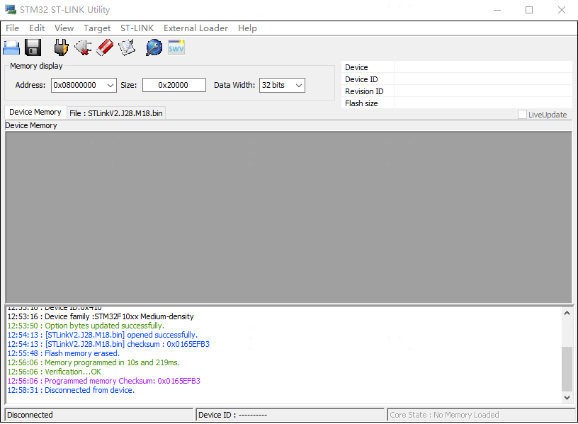

### 升级ST-LINK

* 固件更新有三种方法：
    * 官方固件升级应用程序ST-LinkUpgrade
    * 使用STM32CubeProg或者STM32 ST-LINK utility自带的升级工具升级
    * 使用Keil MDK-ARM 内置的升级工具进行升级，当ST-link 的版本低于MDK内置的版本时，会提示进行升级。Keil MDK-ARM v5.31内置固件升级版本与STM32CubeProg V2.4.0 内置固件升级版本是一样的。
* 本次升级使用ST-LinkUpgrade，升级截图如下：

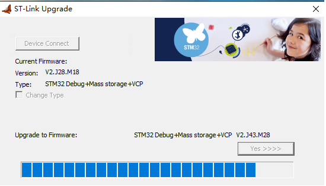

* 至此，ST-LINK的制作就完成了。

## 注意事项

* ST-LINK 固件升级工具不知从哪个版本开始，不支持跨版本更新固件。
* ST-LINK 最近的几个版本的固件已加入了读保护，SWD口是锁上的，所以不能通过SWD口读写固件。
    * 如果想改为其他的，我们可以用STM32 ST-LINK utility将写保护的级别修改。菜单栏target里打开Option Bytes...选项，或者直接通过快捷键ctrl+B打开，请确保当前已经正确连接了stlink和目标板，否则会出现报错。
    * 关键点：将Read Out Protection选项设置为disable，点击Apply，这时候Flash已经成功解锁了。但是同时发现，内部Flash已经被擦除了；这可能STM32的保护机制有关，防止程序被拷机，然后进行反编译破解，这样也可以提高破解的门槛。
    * 完成以上步骤之后，在菜单栏Target下选择Disconnect，或者通过快捷键ctrl+D断开和目标板的连接；重新进入MDK，就能正常对目标板进行调试，仿真，以及程序的烧写。

正确连接的情况下，打开Option Bytes...，发现在这里Read Out Protection选项是enable，这个表示无法通过swd读取STM32内部Flash的程序。
    
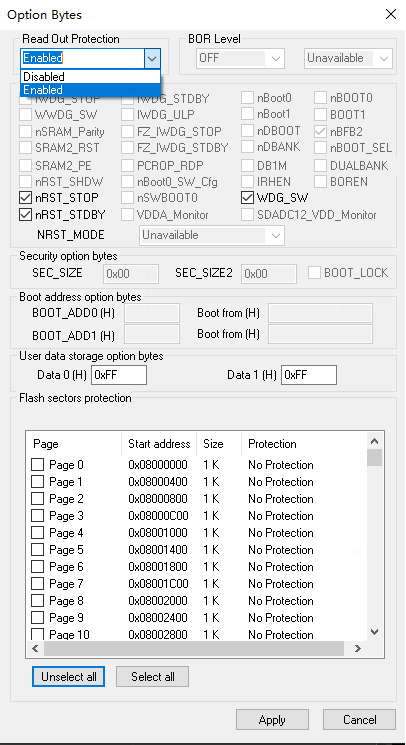

* 如果想改成DAP-LINK 之类的固件，不能通过SWD口烧录固件，但是可以通过ISP的方式擦除STM32的固件信息，然后就可以使用SWD口正常读写。
    * USB转串口连接线烧写（又称ISP烧写，且使用的串口必须是串口1）:
        * Step1:将BOOT0设置为1，BOOT1设置为0，然后按下复位键，这样才能从系统存储器启动BootLoader;
        * Step2:最后在BootLoader的帮助下，通过串口下载程序到Flash中;
        * Step3:程序下载完成后，必须要将BOOT0设置为GND，手动复位，这样，STM32才可以从Flash中启动。

